# Project #1: VPC Flow Logs

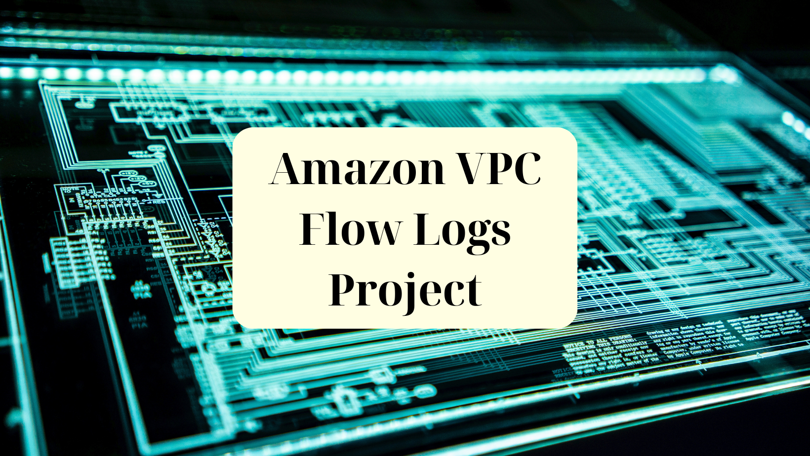

This project involves using VPC flow logs to resolve a connectivity issue between 2 EC2 instances.

I completed this project in the us-east-1 region, however you can use any other AWS region.

For the original project and instructions created by Adrian Cantrill, please visit: [Cantrill Labs](https://github.com/acantril/learn-cantrill-io-labs/tree/master/00-aws-simple-demos/aws-vpc-flow-logs)

# Project Steps

## Step 1: IAM roles

First, we must configure the EC2 SSM Session Manager role.

Navigate to Identity and Access Management (IAM) in the AWS Management Console. 

Click on Roles on the navigation panel on the left. 

Create the role, choosing AWS service for the trusted entity type and EC2 as the use case.

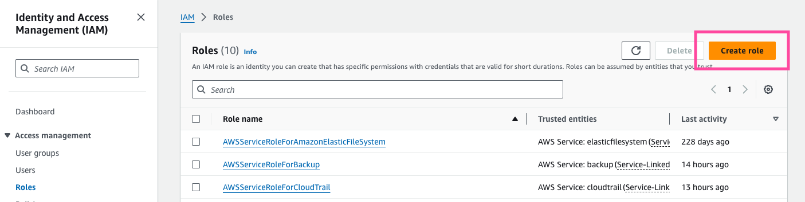

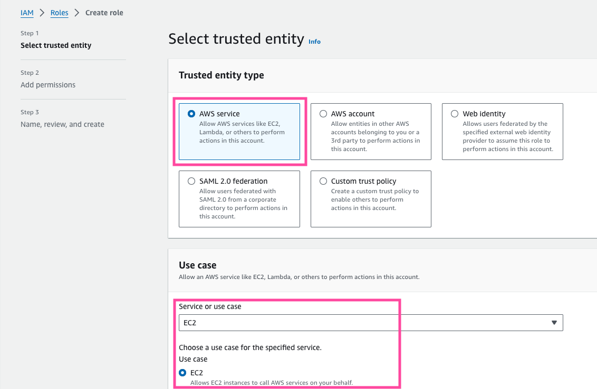

Next, for the permissions choose the AWS managed policy called "AmazonSSMManagedInstanceCore."

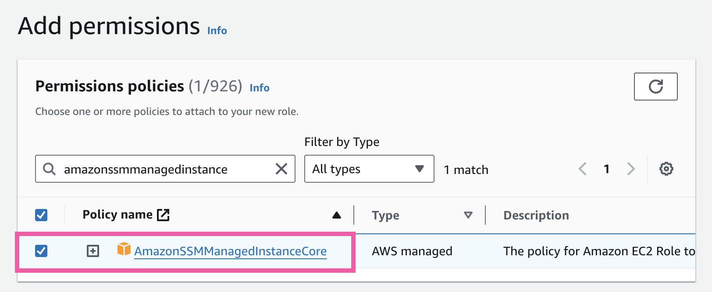

For Role name, you can call it EC2-SSM-Role. Then click "Create role."

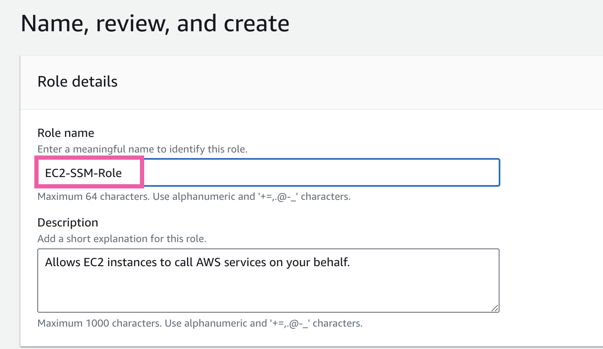

The second role we must create is for the VPC Flow Logs. 

Again, navigate to Roles and click "Create role."


For trusted entity type, select "Custom trust policy" and paste the policy below.

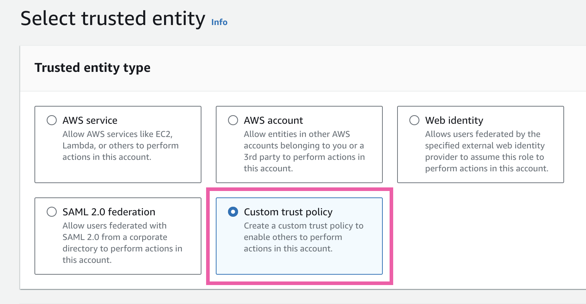

```json
{
  "Version": "2012-10-17",
  "Statement": [
    {
      "Effect": "Allow",
      "Principal": {
        "Service": "vpc-flow-logs.amazonaws.com"
      },
      "Action": "sts:AssumeRole"
    }
  ]
}
```

On the next page for the permissions, choose the "CloudWatchLogsFullAccess" AWS managed policy.

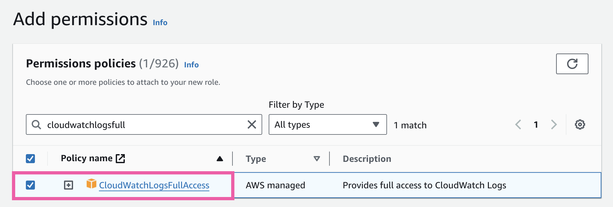

In reality, we would follow the principle of least privilege, providing access only to the specific log group and allowing only the required actions.

On the next page for the Role name, you can call it Flow-Logs-Role. Then click "Create role."

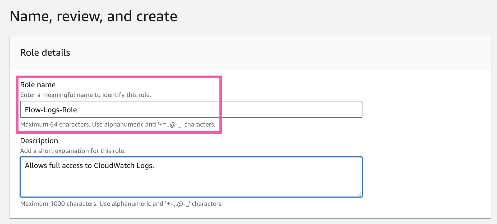

## Step 2: EC2 Instances

Navigate to the EC2 Dashboard and click on Instances on the navigation panel on the left.

Click "Launch instances" on the top right.

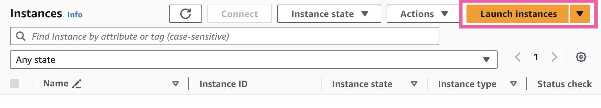

You can name the instance "flow-logs-project" and choose the Amazon Linux 2 AMI.

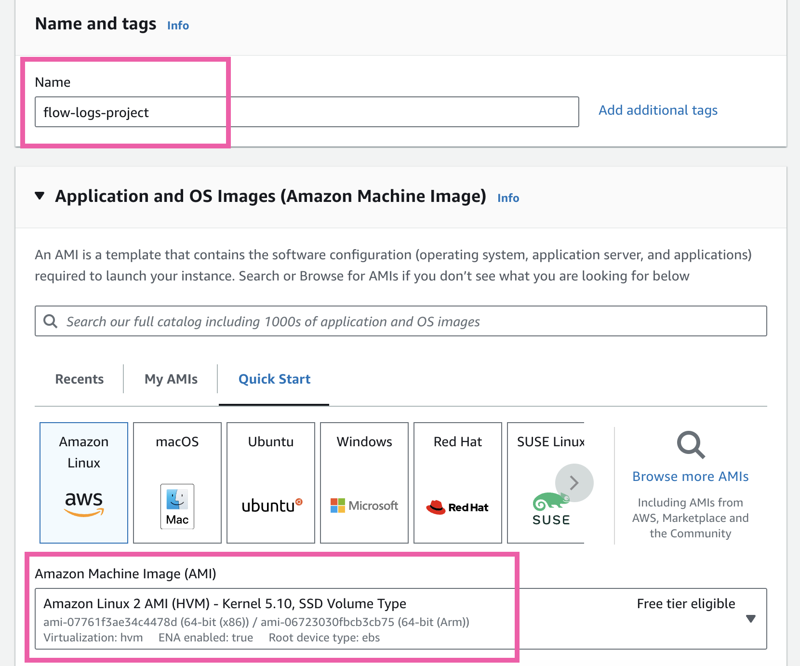

For the instance type, you can leave it as t2.micro. For the key pair, select "Proceed without a key pair."


For the Network settings, keep the default VPC. Under Firewall, keep “Create security group” selected and uncheck “Allow SSH traffic from.” (Don't select any inbound rules. This is intentional as you will see later.)

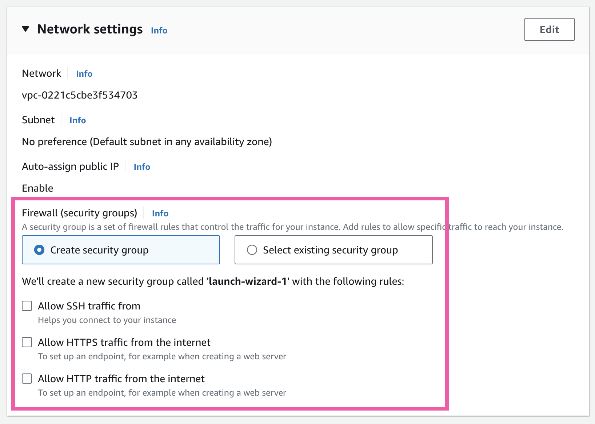

Under Advanced details, for the IAM instance profile choose the EC2-SSM-Role you created in Step 1.

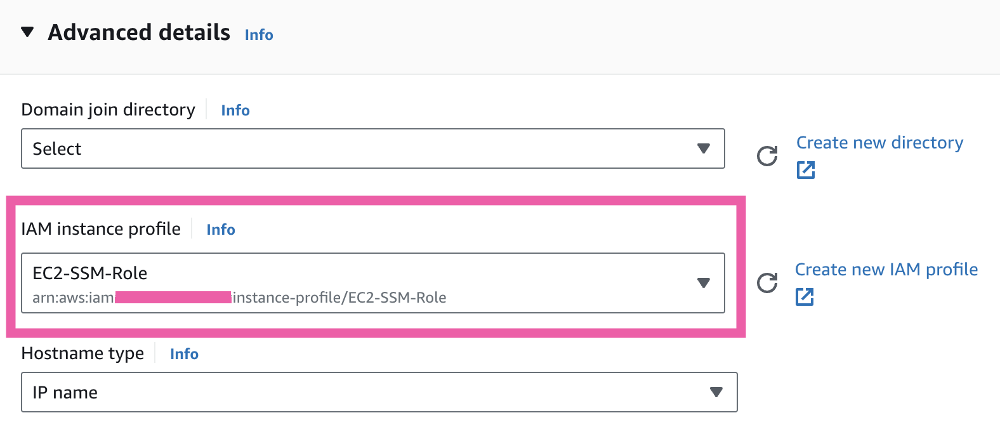

Keep all other default settings. Under the Summary section, enter 2 for the number of instances to launch and click "Launch instance" on the bottom right.

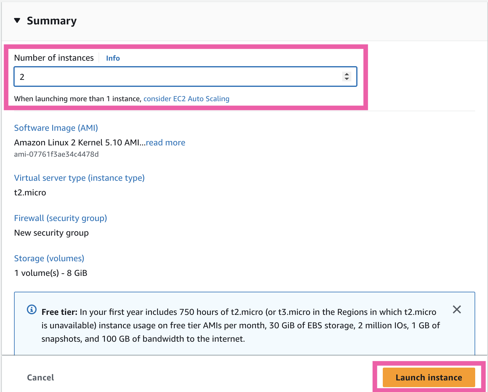

You should now see Success at the top of the page in a green box. Click Instances at the top to see the two instances.

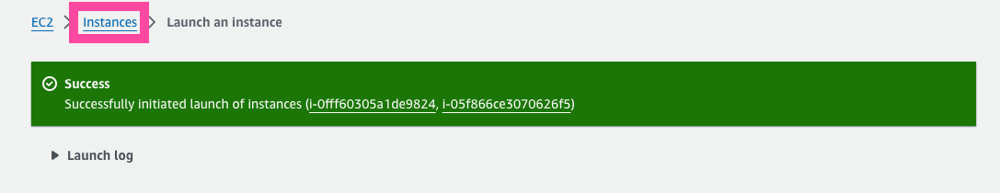

## Step 3: Connect to EC2 Instances

Wait until the instances pass both health checks. Then, select the first instance and click Connect.

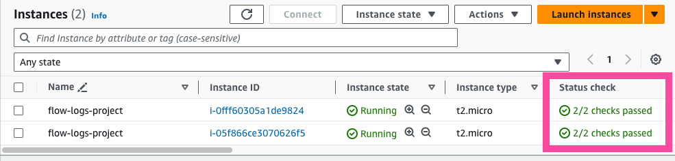

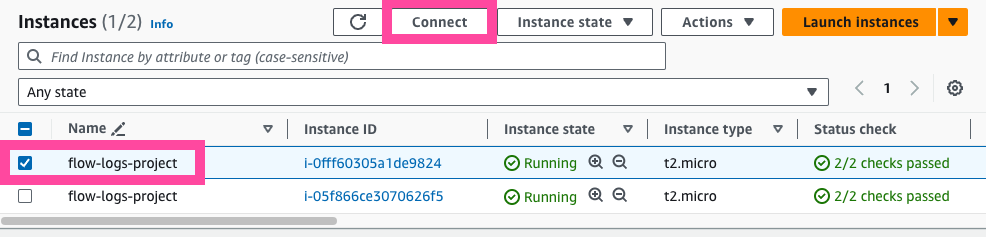

Under the Session Manager tab click Connect.

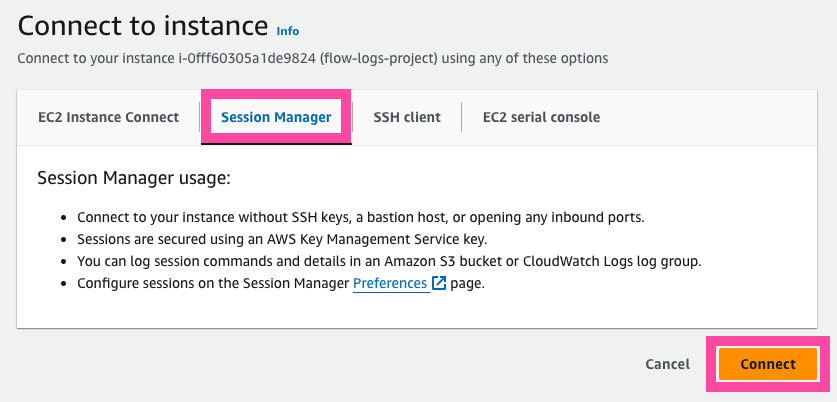

This opens a shell to the instance. Now, open a new tab in your browser and navigate to EC2 in the AWS Management Console. Click on Instances on the navigation panel on the left, select the second instance, and click Connect. (We can check the instance ID to make sure we're not connecting to the first instance again.)

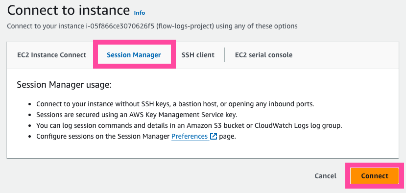

## Step 4: Pinging the second instance

We can run the command `ip a` on both instance shells. The IP on interface `eth0` is the private IP of the instance, which we can also see in the console.

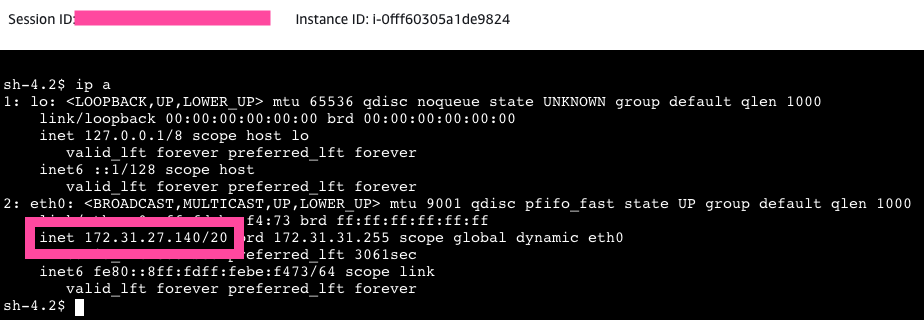

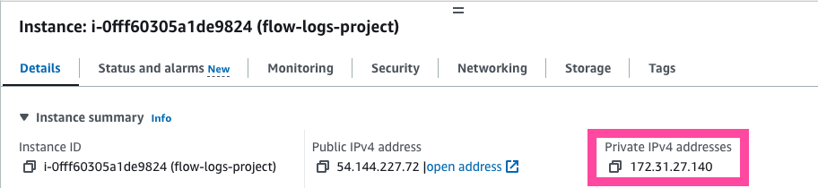

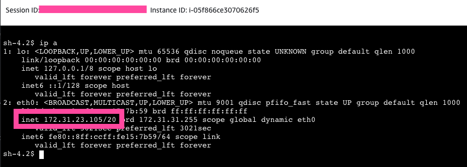

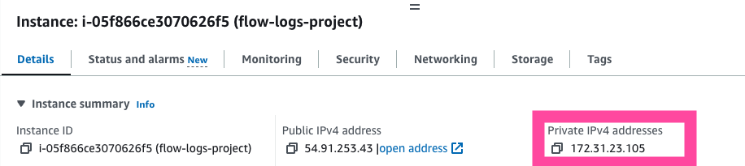

From the shell of the first instance, we will try to ping the second instance using the command `ping <ip address> -c 3 -W 1`. Replace `<ip address>` with the private IP of the second instance.

We are telling ping to exit after sending 3 ping packets (`-c 3`), compared to the default of pinging endlessly until we exit by using Ctrl C. We are telling ping to wait 1 second (`-W 1`). If it doesn't hear a response after 1 second, the packet is timed out.

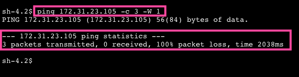

The ping statistics show that 3 packets were sent, 0 packets received, and 100% packet loss, indicating that the second instance did not respond.

We can ping Google's DNS servers (IP 8.8.8.8), which we know are working, to rule out an issue with the first instance that is performing the ping.

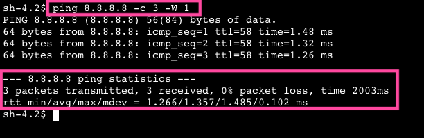

This shows 3 packets sent, 3 received, and 0% packet loss, which indicates the outbound ping is working. We need to figure out where the ping packet is being lost or blocked when we ping the second instance.

This issue will be easier to diagnose because the instances are in the same subnet, and hence the same AZ. It would be more challenging if they were in different networks or data centers with more routers and firewalls between them.

## Step 5: Create CloudWatch log group

Nagivate to CloudWatch in the AWS Management Console.

On the navigation panel on the left, under Logs, click on Log groups. Click "Create log group" on the top right.

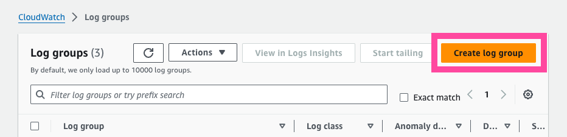

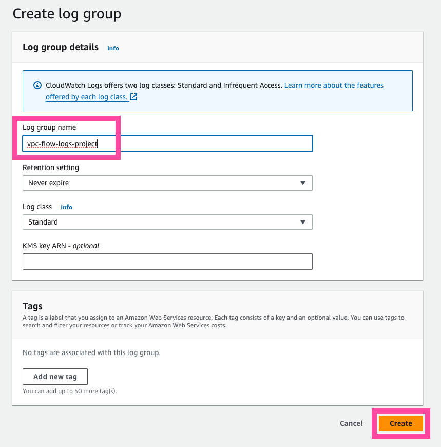

## Step 6: Create VPC flow log

Navigate to VPC in the AWS Management Console.

On the panel on the left, click "Your VPCs" and select the default VPC in which you launched the two EC2 instances. At the bottom, head to the "Flow logs" tab and click the orange "Create flow log" button.

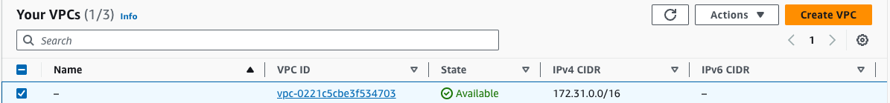

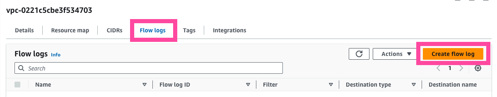

We can name our flow log "flow-log-project" and set the Maximum aggregation interval to 1 minute. 

For Destination, keep "Send to CloudWatch Logs" and under Destination log group choose the CloudWatch log group we created in Step 5, called vpc-flow-logs-project.

Then choose the flow log IAM role we created in Step 1, called Flow-Logs-Role. Keep everything else default. Click on "Create flow log" on the bottom right.

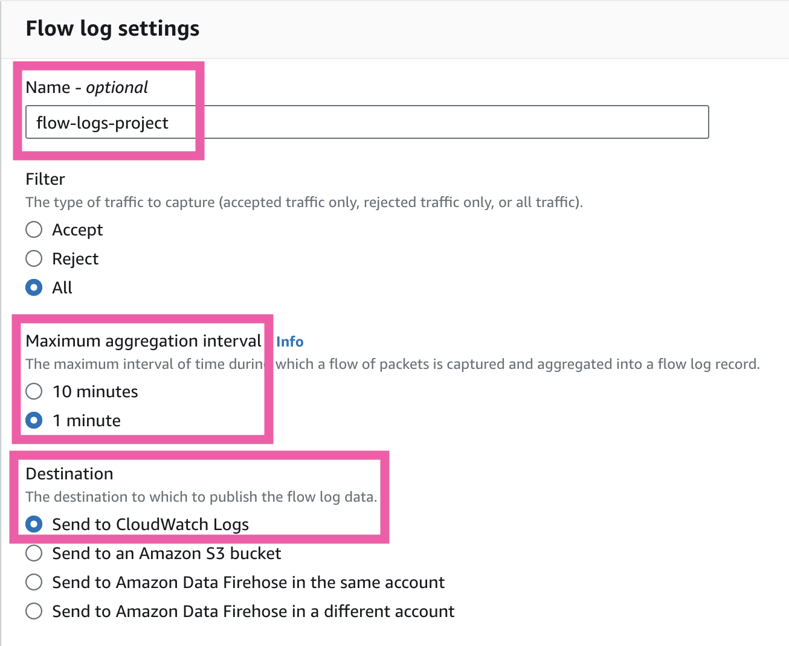

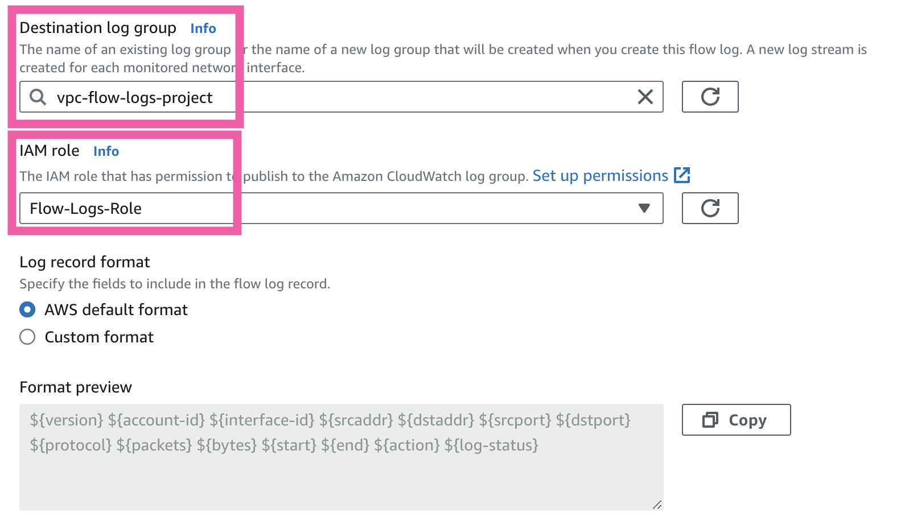

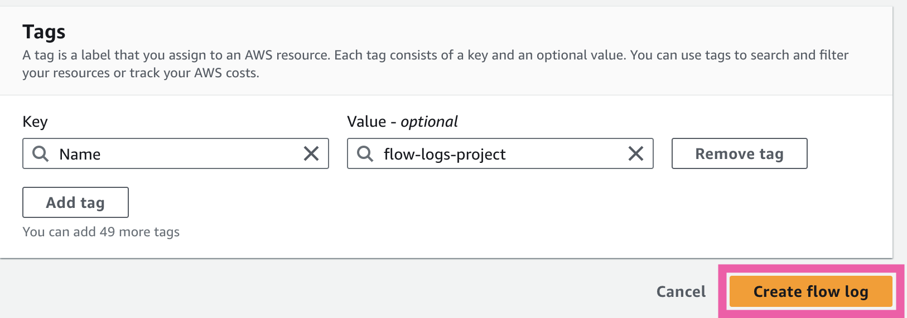

Now return to the Session Manager console with the shell to our first instance. We need to try connecting to the second instance again. Run the `ping <ip address> -c 3 -W 1` command again with the private IP of the second instance.

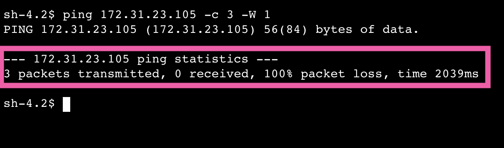

Again, it should show 100% packet loss under the ping statistics.

Next, we will obtain the ENI ID of the first instance with the following command: 

```bash
TOKEN=`curl -X PUT "http://169.254.169.254/latest/api/token" -H "X-aws-ec2-metadata-token-ttl-seconds: 21600"` \ 
&& curl -H "X-aws-ec2-metadata-token: $TOKEN" http://169.254.169.254/latest/meta-data/network/interfaces/macs/"$(TOKEN=`curl -X PUT "http://169.254.169.254/latest/api/token" -H "X-aws-ec2-metadata-token-ttl-seconds: 21600"` \
&& curl -H "X-aws-ec2-metadata-token: $TOKEN" http://169.254.169.254/latest/meta-data/mac)"/interface-id
```

This uses the Instance Metadata Service (IMDSv2). Visit the following [Amazon EC2 documentation](https://docs.aws.amazon.com/AWSEC2/latest/UserGuide/instancedata-data-retrieval.html) for an explanation of IMDSv2 vs. IMDSv1.

Most likely, your instance requires you to use IMDSv2 instead of IMDSv1. The place you can check that is in the EC2 console, under Instances. If you select the first instance and scroll down a bit under the "Details" tab, you will see "IMDSv2" and underneath it will say either Required or Optional. If Required, you must use IMDSv2, as I have in the example above. If it says Optional, you can use IMDSv1.

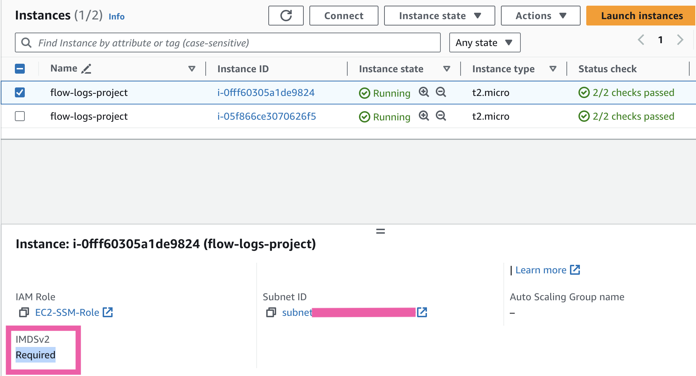

This is how it should look like when you run the command from the shell (I have highlighted the interface id - it starts with "eni"): 

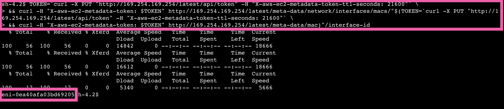

We can also get the ENI ID through the EC2 console. Click on Instances and select the first instance we were pinging from. Once it is selected, choose the "Networking" tab at the bottom and copy the ENI ID under Network Interfaces.

Note how it matches the output of our IMDSv2 command!

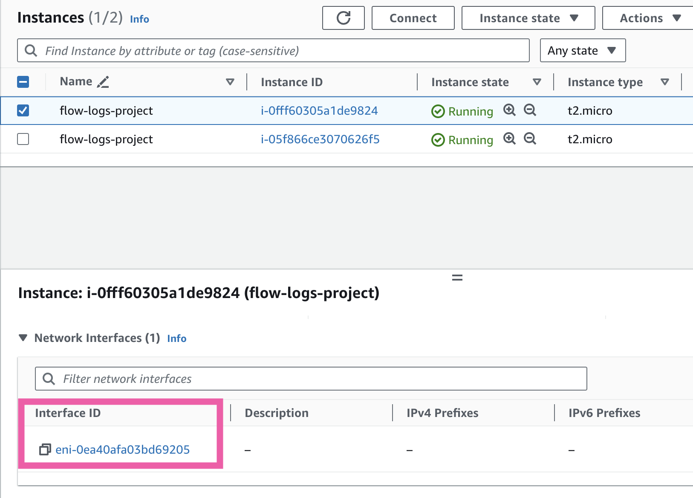

We will use the ENI ID in the next step.

## Step 7: Diagnosing the connectivity issue

In this step we will diagnose the connectivity issue between the two instances by checking the VPC Flow Log we created in the previous step.

Navigate to CloudWatch in the AWS Management Console. Click on Log groups under Logs on the left, and then click on the vpc-flow-logs-project log group we created.

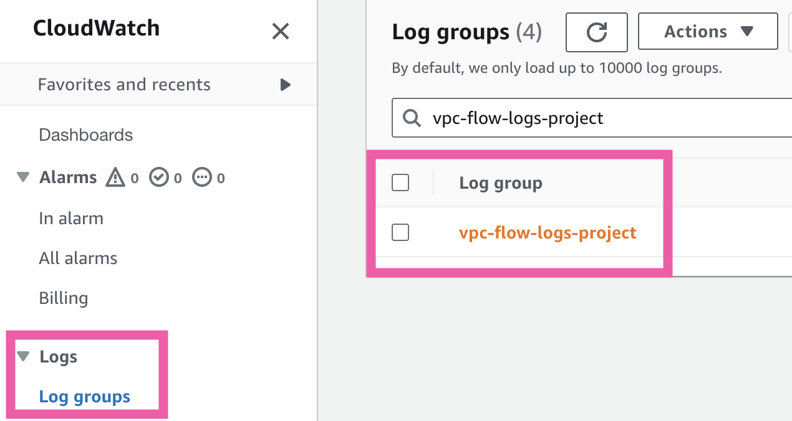

You should see log streams in the log group for each ENI sending traffic in this default VPC. (Keep in mind that in reality, for a company's production environment you could have thousands of log streams corresponding to every ENI sending traffic in that VPC.)

Under the Log streams tab at the bottom, you can search for the ENI ID we copied in Step 6. 

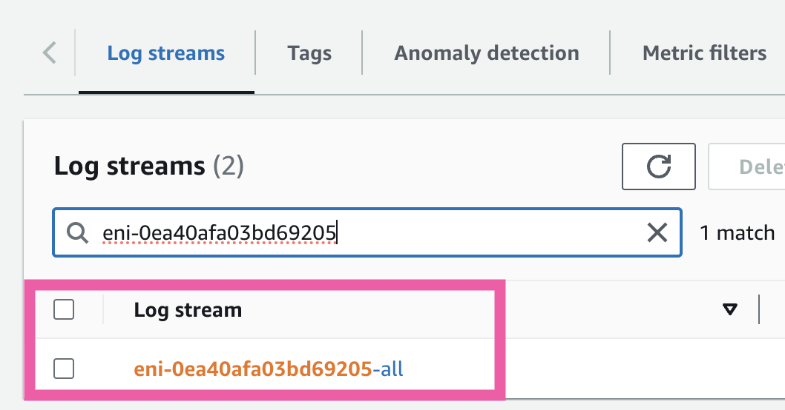

Click on the log stream. 