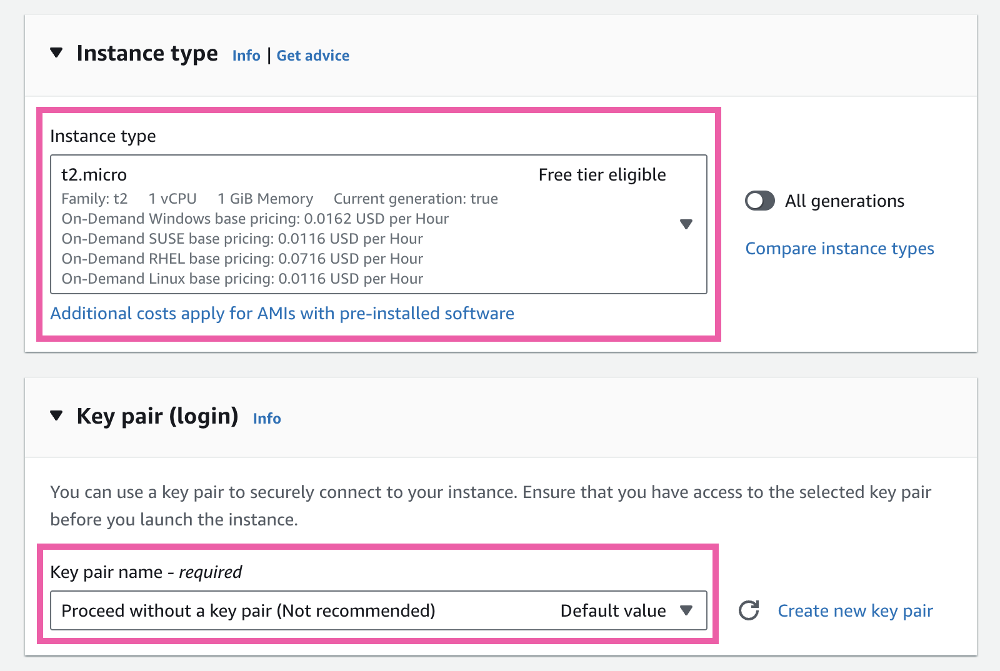

# Project #1: VPC Flow Logs


This project involves using VPC flow logs to resolve a connectivity issue between 2 EC2 instances.

I completed this project in the us-east-1 region, however you can use any other AWS region.

For the original project and instructions created by Adrian Cantrill, please visit: [Cantrill Labs](https://github.com/acantril/learn-cantrill-io-labs/tree/master/00-aws-simple-demos/aws-vpc-flow-logs)

# Project Steps

## Step 1: IAM roles

First, we must configure the EC2 SSM Session Manager role.

Navigate to Identity and Access Management (IAM) in the AWS Management Console. 

Click on Roles on the navigation panel on the left. 

Create the role, choosing AWS service for the trusted entity type and EC2 as the use case.


Next, for the permissions choose the AWS managed policy called "AmazonSSMManagedInstanceCore."


For Role name, you can call it EC2-SSM-Role. Then click "Create role."


The second role we must create is for the VPC Flow Logs. 

Again, navigate to Roles and click "Create role."


For trusted entity type, select "Custom trust policy" and paste the policy below.


```json
{
  "Version": "2012-10-17",
  "Statement": [
    {
      "Effect": "Allow",
      "Principal": {
        "Service": "vpc-flow-logs.amazonaws.com"
      },
      "Action": "sts:AssumeRole"
    }
  ]
}
```

On the next page for the permissions, choose the "CloudWatchLogsFullAccess" AWS managed policy.


In reality, you would follow the principle of least privilege, providing access only to the specific log group and allowing only the required actions.

On the next page for the Role name, you can call it Flow-Logs-Role. Then click "Create role."


## Step 2: EC2 Instances

Navigate to the EC2 Dashboard and click on Instances on the navigation panel on the left.

Click "Launch instances" on the top right.


You can name the instance "flow-logs-project" and choose the Amazon Linux 2 AMI.


For the instance type, you can leave it as t2.micro. For the key pair, select "Proceed without a key pair."



For the Network settings, keep the default VPC. Under Firewall, keep “Create security group” selected and uncheck “Allow SSH traffic from.” (Don't select any inbound rules. This is intentional as you will see later.)


Under Advanced details, for the IAM instance profile choose the EC2-SSM-Role you created in Step 1.


Keep all other default settings. Under the Summary section, enter 2 for the number of instances to launch and click "Launch instance" on the bottom right.

